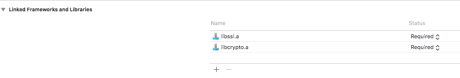
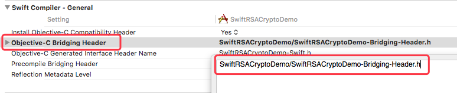

## SwiftRSACrypto

[YYRSACrypto](https://github.com/Kejiasir/YYRSACrypto) 的 Swift 版本，基于 Objc 的 [MIHCrypto](https://github.com/hohl/MIHCrypto) 封装，所以是一个混编的工具类。

* Swift 版本：4.1
* Xcode 版本：9.3.1
* 适用于：iOS 8.0+

## Installation：

**不支持 Cocoapods 安装，因为里面有两个 `.a静态库` 不能通过 Cocoapods 验证**

#### 手动安装：

* Clone 本项目，将项目中的 `SwiftRSACrypto` 文件夹拷贝到你的项目

* 在 `Linked Frameworks and Libraries` 中添加 `libssl.a` 和 `libcrypto.a` 这两个静态库

    <table> 
         <td>
            
         </td> 
     </table>

* 如果你是 Swift 混编 OC 的项目，想必已经创建了 `ProjectName-Bridging-Header.h` 这个桥接文件
    * 在 `ProjectName-Bridging-Header.h` 桥接文件中 `#import "RSABridgingHeader.h"` 即可
    
* 如果你是纯 Swift 项目，则需要先创建 `ProjectName-Bridging-Header.h` 桥接文件
    * 方法一：随意创建一个 Objc 文件，Xcode 会弹窗提示帮你创建一个桥接文件，选择 Create
    * 方法二：手动创建，命名规则：`项目名称+Bridging-Header.h`，然后在 `Build Settings` 中设置路径
    
   <table>  </table>
    <table> 
         <td>
            
         </td> 
     </table>
     
    * 最后在 `ProjectName-Bridging-Header.h` 桥接文件中 `#import "RSABridgingHeader.h"` 即可

## Usage

```swift
/// 生成秘钥对
SwiftRSACrypto.rsa_generate_key({ (keyPair, isExist) in
    if let keyPair = keyPair {
        /// 公钥加密 -> 私钥解密
        if let enStr = SwiftRSACrypto.publicEncrypt(keyPair, encryptStr: "Hello World!") {
            if let deStr = SwiftRSACrypto.privateDecrypt(keyPair, decryptStr: enStr) {
                print("加密后的密文: \(enStr)")
                print("解密后的原文: \(deStr)")
            }
        }
        /// 私钥加密 -> 公钥解密
        if let enStr = SwiftRSACrypto.privateEncrypt(keyPair, encryptStr: "Hello World!") {
            if let deStr = SwiftRSACrypto.publicDecrypt(keyPair, decryptStr: enStr) {
                print("加密后的密文: \(enStr)")
                print("解密后的原文: \(deStr)")
            }
        }
    }
}, archiverFileName: nil)
```
* 更多示例可以下载 Demo 查看

## Interface：

```swift

// MARK: - 生成秘钥对

/// 生成RSA密钥对
///
/// - Parameters:
///   - callback: 回调生成的密钥对模型，秘钥size为 1024 字节
///   - fileName: 归档到沙盒时设置的文件名，如果没有归档，填nil
public class func rsa_generate_key(_ callback: KeyPairExist, archiverFileName fileName: String?) -> Void

/// 生成RSA密钥对
///
/// - Parameters:
///   - callback: 回调生成的密钥对模型
///   - keySize: 枚举，可指定生成的秘钥大小
///   - fileName: 归档到沙盒时设置的文件名，如果没有归档，填nil
public class func rsa_generate_key(_ callback: KeyPairExist, ofKeySize keySize: MIHRSAKeySize, archiverFileName fileName: String?) -> Void

// MARK: - 私钥加密，公钥解密

/// 私钥加密
///
/// - Parameters:
///   - keyPair: 密钥对模型
///   - dataStr: 需加密的字符串
/// - Returns: 返回加密后的密文字符串
public class func privateEncrypt(_ keyPair: MIHKeyPair, encryptStr dataStr: String) -> String?

/// 公钥解密
///
/// - Parameters:
///   - keyPair: 密钥对模型
///   - dataStr: 需解密的密文字符串
/// - Returns: 返回解密后的原文字符串
public class func publicDecrypt(_ keyPair: MIHKeyPair, decryptStr dataStr: String) -> String?

// MARK: - 公钥加密，私钥解密

/// 公钥加密
///
/// - Parameters:
///   - keyPair: 密钥对模型
///   - dataStr: 需加密的字符串
/// - Returns: 返回加密后的密文字符串
public class func publicEncrypt(_ keyPair: MIHKeyPair, encryptStr dataStr: String) -> String?

/// 私钥解密
///
/// - Parameters:
///   - keyPair: 密钥对模型
///   - dataStr: 需解密的密文字符串
/// - Returns: 返回解密后的原文字符串
public class func privateDecrypt(_ keyPair: MIHKeyPair, decryptStr dataStr: String) -> String?

// MARK: - 归档&&解档->沙盒

/// 归档 MIHKeyPair 模型到沙盒中
///
/// - Parameters:
///   - keyPair: 密钥对模型
///   - name: 归档到沙盒的文件名，带后缀，例如："keyPair.archiver"
/// - Returns: 返回归档结果，成功返回 true，否则 false
public class func archiverKeyPair(_ keyPair: MIHKeyPair, fileName name: String) -> Bool

/// 从沙盒中解档 MIHKeyPair 模型
///
/// - Parameters:
///   - callback: 通过闭包回调解档出来的密钥对模型
///   - name: 归档时设置的文件名，根据文件名取出归档的数据，不能为 nil
public class func unarchiverKeyPair(_ callback: KeyPairBlock, fileName name: String) -> Void

// MARK: - 存储&&读取->偏好设置

/// 存储 MIHKeyPair 模型到偏好设置
///
/// - Parameter keyPair: 需要存储的密钥对模型
public class func archiverKeyPair(_ keyPair: MIHKeyPair) -> Void

/// 从偏好设置中读取 MIHKeyPair 模型
///
/// - Parameter callback: 通过闭包回调读取的密钥对模型
public class func unarchiverKeyPair(_ callback: KeyPairBlock) -> Void

// MARK: - 文件操作

/// 判断偏好设置中是否已存在 MIHKeyPair 模型
///
/// - Returns: 如果有返回 true，否则返回 false
public class func isExistFileWithUserDefaults() -> Bool

/// 从偏好设置中删除 MIHKeyPair 模型
///
/// - Returns: 删除成功返回 true，否则返回 false
public class func removeFileFromUserDefaults() -> Bool

/// 从沙盒中删除文件 (MIHKeyPair 模型)
///
/// - Parameter fileName: 归档到沙盒时设置的文件名
/// - Returns: 删除成功返回 true，否则返回 false
public class func removeFileFromDocumentsDir(fileName: String) -> Bool

// MARK: - 获取密钥对字符串

/// 获取Base64编码后的公钥字符串
///
/// - Parameter keyPair: 密钥对模型
/// - Returns: 返回公钥字符串
public class func getPublicKey(_ keyPair: MIHKeyPair) -> String?

/// 获取Base64编码后的私钥字符串
///
/// - Parameter keyPair: 密钥对模型
/// - Returns: 返回私钥字符串
public class func getPrivateKey(_ keyPair: MIHKeyPair) -> String?

// MARK: - 获取格式化后的密钥对字符串

/// 获取格式化后的公钥（即标准的 PKCS#8 格式公钥）
///
/// - Parameter keyPair: 密钥对模型
/// - Returns: 返回格式化后的公钥字符串
public class func getFormatterPublicKey(_ keyPair: MIHKeyPair) -> String?

/// 获取格式化后的私钥（即标准的 PKCS#1 格式私钥）
///
/// - Parameter keyPair: 密钥对模型
/// - Returns: 返回格式化后的私钥字符串
public class func getFormatterPrivateKey(_ keyPair: MIHKeyPair) -> String?

// MARK: - 设置服务器返回的秘钥字符串

/// 设置公钥和私钥，当秘钥是由服务器返回的时候，可使用此方法来获得密钥对模型
///
/// - Parameters:
///   - callback: 通过闭包回调 MIHKeyPair 密钥对模型
///   - aPublicKey: 公钥字符串，须是去掉头尾和换行符等的纯公钥字符串
///   - aPrivateKey: 私钥字符串，须是去掉头尾和换行符等的纯私钥字符串
public class func keyPair(_ callback: KeyPairBlock, publicKey aPublicKey: String?, privateKey aPrivateKey: String?) -> Void

/// 设置公钥和私钥，当秘钥是由服务器返回的时候，可使用此方法来获得密钥对模型
///
/// - Parameters:
///   - aPublicKey: 公钥字符串，须是去掉头尾和换行符等的纯公钥字符串
///   - aPrivateKey: 私钥字符串，须是去掉头尾和换行符等的纯私钥字符串
/// - Returns: 返回 MIHKeyPair 密钥对模型
public class func setPublicKey(_ aPublicKey: String?, privateKey aPrivateKey: String?) -> MIHKeyPair?

// MARK: - 私钥签名

/// RSA私钥签名，SHA256
///
/// - Parameters:
///   - keyPair: 密钥对模型
///   - msg: 需要签名的字符串
/// - Returns: 返回签名后的字符串
public class func sha256_signature(_ keyPair: MIHKeyPair, message msg: String) -> String?

/// RSA私钥签名，SHA128
///
/// - Parameters:
///   - keyPair: 密钥对模型
///   - msg: 需要签名的字符串
/// - Returns: 返回签名后的字符串
public class func sha128_signature(_ keyPair: MIHKeyPair, message msg: String) -> String?
/// RSA私钥签名，MD5
///
/// - Parameters:
///   - keyPair: 密钥对模型
///   - msg: 需要签名的字符串
/// - Returns: 返回签名后的字符串
public class func md5_signature(_ keyPair: MIHKeyPair, message msg: String) -> String?

// MARK: - 公钥验签

/// RSA公钥验签，SHA256
///
/// - Parameters:
///   - keyPair: 密钥对模型
///   - signStr: 需要验证的签名字符串
///   - msg: 需要验证的消息字符串
/// - Returns: 返回验证结果，验证通过返回 true，否则 false
public class func verifySignature(_ keyPair: MIHKeyPair, SHA256 signStr: String, message msg: String) -> Bool

/// RSA公钥验签，SHA128
///
/// - Parameters:
///   - keyPair: 密钥对模型
///   - signStr: 需要验证的签名字符串
///   - msg: 需要验证的消息字符串
/// - Returns: 返回验证结果，验证通过返回 true，否则 false
public class func verifySignature(_ keyPair: MIHKeyPair, SHA128 signStr: String, message msg: String) -> Bool

/// RSA公钥验签，MD5
///
/// - Parameters:
///   - keyPair: 密钥对模型
///   - signStr: 需要验证的签名字符串
///   - msg: 需要验证的消息字符串
/// - Returns: 返回验证结果，验证通过返回 true，否则 false
public class func verifySignature(_ keyPair: MIHKeyPair, MD5 signStr: String, message msg: String) -> Bool

```
